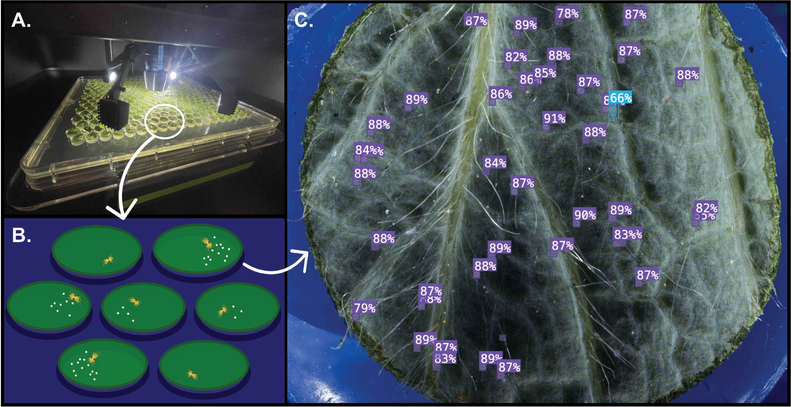

# Automated detection and quantification of two-spotted spider mite life stages using computer vision for high-throughput *in vitro* assays

## Introduction
Here, we present a high-throughput, semi-automated image analysis pipeline integrating the Blackbird CNC Microscopy Imaging Robot (available from [MoBlanc Robotics](https://moblancrobotics.com/)) with computer vision models for mite life stage identification. We developed a [publicly available Roboflow hosted dataset](https://universe.roboflow.com/gent-lab/tssm-detection-v2/) of over 1,500 annotated images (nearly 32,000 labeled instances) spanning five biologically relevant classes across ten host species and >25 hop cultivars. Three YOLOv11-based object detection models (three-, four-, and five-class configurations) were trained with real and synthetic data and then evaluated on a diverse hold out set of real data. The three-class model achieved the highest overall performance on the hold out test set (precision = 0.875, recall = 0.871, mAP50 = 0.883), with detection accuracy robust to host background and moderate object densities. these contributions provide a foundation for semi-automated *in vitro* TSSM phenotyping and support the integration of image-based monitoring into TSSM management and resistance breeding programs.

## Overview

Training and evaluation logs for models v209, v210, and v211 can be found [here](v209_v210_v211_train_eval.ipynb). 

All referenced data and models are hosted on [Roboflow](https://universe.roboflow.com/gent-lab/). Performance metrics and specifications can be found below:

| Version | Type |  Details                                     | Stage | Images | Instances | Precision | Recall | mAP50 | mAP50-95 | #Classes | Classes                                                  |
|---------|---------|---------------------------------------------|-------|--------|-----------|-----------|--------|--------|-----------|----------|-----------------------------------------------------------|
| [v209](https://universe.roboflow.com/gent-lab/tssm-detection-v2/model/209) | Object Detection  | With synthetic data, patience = 25, no pre-train augmentations | Val | 118    | 1841      | 0.836     | 0.822  | 0.869  | 0.559     | 5        | Adult_female, Immature, Viable_egg                        |
| [v209](https://universe.roboflow.com/gent-lab/tssm-detection-v2/model/209) | Object Detection  | With synthetic data, patience = 25, no pre-train augmentations | Test  | 117    | 2093      | 0.824     | 0.743  | 0.788  | 0.532     | 5        | Adult_female, Adult_male, Dead_mite, Immature, Viable_egg |
| [v210](https://universe.roboflow.com/gent-lab/tssm-detection-v2/model/210) | Object Detection  | With synthetic data, patience = 25, no pre-train augmentations | Val | 118    | 1683      | 0.892     | 0.925  | 0.939  | 0.597     | 3        | Adult_female, Immature, Viable_egg                        |
| [v210](https://universe.roboflow.com/gent-lab/tssm-detection-v2/model/210) | Object Detection  | With synthetic data, patience = 25, no pre-train augmentations | Test  | 117    | 1938      | 0.875     | 0.871  | 0.883  | 0.601     | 3        | Adult_female, Immature, Viable_egg                        |
| [v211](https://universe.roboflow.com/gent-lab/tssm-detection-v2/model/211) | Object Detection  | With synthetic data, patience = 25, no pre-train augmentations | Val | 118    | 1738      | 0.871     | 0.845  | 0.913  | 0.597     | 4        | Adult_female, Adult_male, Immature, Viable_egg            |
| [v211](https://universe.roboflow.com/gent-lab/tssm-detection-v2/model/211) | Object Detection  | With synthetic data, patience = 25, no pre-train augmentations | Test  | 115    | 1949      | 0.903     | 0.835  | 0.871  | 0.576     | 4        | Adult_female, Adult_male, Immature, Viable_egg            |
| [v118](https://universe.roboflow.com/gent-lab/tssm-detection-instance-segmentation/model/118) | Instance Segmentation | With synthetic data, patience = 25, no pre-train augmentations | Val |  40 | 639   |  0.898     |  0.892    |  0.927 |  0.704 |   4    | Adult_female, Adult_male, Immature, Viable_egg        

## Data Visualization
Datasheets and R code used to create figures in our paper cound be found in [`/datasheets`](datasheets) and [`/R_visualizations`](R_visualizations)

## Model Weights and Test Sets
To enable easier reproduction of our results, the referenced test sets and models in Wiseman et al. 2025 are also hosted separately [here](https://doi.org/10.5281/zenodo.16945379) and [here](https://doi.org/10.5281/zenodo.16945337), respectively. 

## Custom Inference Evaluation
YOLOv11 comes with a built in validation function, but we wanted to extract more performance information about our models; thus, we mainly ran `jobs.sh` that called our custom inference testing script ([`/inference/inference_testing.py`](/inference/inference_testing.py)). 

The `inference_testing.py` has a number of built-in extended ground truth validation metrics in addition to expanded arg-parse commands including: 

- per-image performance metrics (IoU, recall, precision)
- ground truth and inference bounding boxes overlaid onto evaluated image (**A** below)
- missed detection mapping (**B** below)
- edge detection evaluation

# Contact
Michele Wiseman:
<michele.wiseman@oregonstate.edu>

